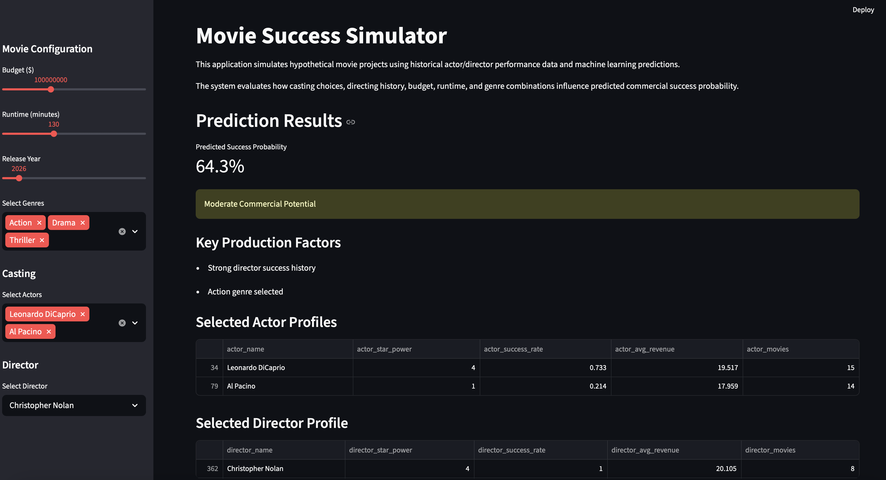
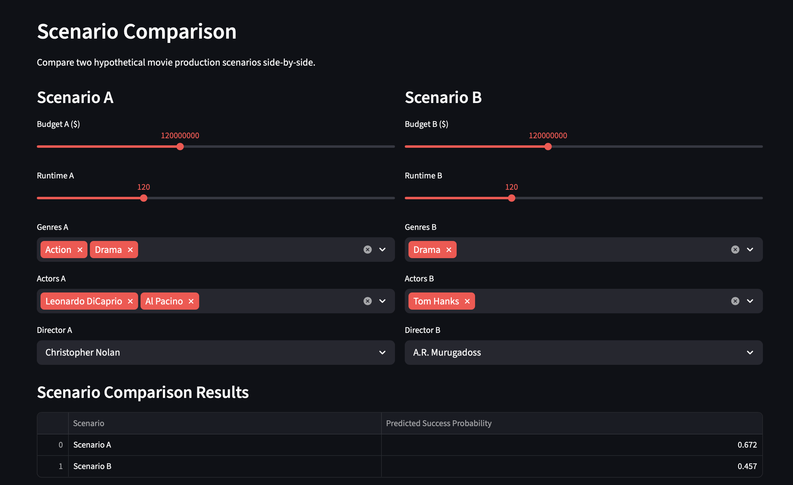

# Movie Success Prediction, Scenario Simulation, and Decision Support Analytics

This project applies supervised and unsupervised machine learning techniques to movie industry data to predict **pre-release commercial movie success** and analyze historical actor and director performance patterns.

Using movie metadata from **TMDB and IMDb (2000–2025)**, the project combines exploratory data analysis, predictive modeling, clustering, historical feature engineering, and interactive analytics to create a reusable movie production decision-support framework.

The system predicts whether a movie will become financially successful using only information available before release, including production budget, runtime, genre composition, historical actor performance, historical director performance, and engineered star power variables.

A movie is classified as **financially successful if its box office revenue is at least two times its production budget**.

In addition to predictive modeling, the project introduces a **scenario simulation framework** that allows hypothetical movie projects to be dynamically evaluated by modifying actors, directors, genres, budgets, and runtimes while observing how those changes influence predicted commercial success probabilities.

---

## Interactive Prediction Application



The final machine learning pipeline is integrated into an interactive **Streamlit application**, allowing users to construct hypothetical movie projects and generate real-time predictions of commercial success.

---

## Project Objectives

The primary goals of the project are:

- Predict pre-release commercial movie success using machine learning
- Explore historical relationships between genre, budget, actors, directors, ROI, and audience ratings
- Engineer reusable historical actor and director performance features
- Identify actor commercial performance archetypes using clustering techniques
- Compare multiple machine learning approaches using a temporal validation framework
- Build a scenario simulation framework for hypothetical movie production analysis
- Develop an interactive analytics application for real-time movie success prediction
- Explore how casting, directing, genres, runtime, and budget allocation influence predicted commercial outcomes

---

## Data

The project combines movie information from **TMDB** and **IMDb** covering releases from **2000–2025**.

The merged dataset incorporates:

- Production budget and box office revenue
- Release year
- Runtime
- Genres
- IMDb ratings and audience engagement
- Actor participation
- Director information
- Historical actor and director performance

The datasets were cleaned, filtered, and merged into a unified analytical dataset used for exploratory analysis, feature engineering, clustering, and predictive modeling.

Additional information about the original datasets is available in `Data Sources.txt`.

---

## Exploratory Data Analysis

Exploratory analysis focused on three major dimensions of movie performance:

- **Financial efficiency** — Return on Investment (ROI)
- **Audience reception** — IMDb ratings
- **Production scale** — Budget

The analysis examined these relationships across genres, actors, directors, and different time periods.

Several broader patterns emerged. Cost-efficient genres such as Horror and Documentary frequently generated high ROI despite relatively modest production budgets, while high-budget genres achieved greater production scale but not necessarily greater financial efficiency.

Actor- and director-level analysis similarly showed that production scale, ROI, and audience reception represent distinct dimensions of performance. High-budget franchise participants were not necessarily the actors or directors associated with the highest ROI.

These findings motivated the use of historical aggregated features rather than relying only on individual actor, director, or genre identifiers.

---

## Historical Actor and Director Performance Engineering

Historical performance profiles were created for actors and directors using **training-period movie data only** to reduce temporal leakage.

Engineered historical features include:

- Average revenue
- Average ROI
- Average ratings
- Historical success rate
- Movie participation frequency
- Production scale indicators
- Actor star power
- Director historical performance indicators

Missing historical information for previously unseen actors and directors was handled using missing-history indicators together with zero-value imputation. This allowed the models to distinguish between genuinely low historical performance and individuals without available historical records.

Actor- and director-level historical information was subsequently aggregated into movie-level features used by the predictive models.

---

## Actor Star Power Clustering

K-Means clustering was applied to actor-level historical performance metrics to identify broader commercial performance archetypes.

Clustering incorporated variables such as:

- Average movie revenue
- ROI
- Ratings
- Historical success rate
- Movie participation frequency
- Production budget scale

The resulting actor clusters were converted into simplified **star power categories** representing broader historical commercial performance patterns rather than subjective celebrity reputation.

Movie-level features derived from these profiles include variables such as average actor star power, maximum actor star power, and cast-related information.

Clustering provided a compact representation of multi-dimensional actor performance while reducing the sparsity associated with individual actor-based features.

---

## Temporal Modeling Strategy

Because the objective is to predict the success of future movie releases using historical information, the project uses a **chronological train/validation/test split** rather than a random split.

- **Training:** Movies released before 2016
- **Validation:** Movies released from 2016–2020
- **Testing:** Movies released during and after 2021

Movies released in **2020 were excluded** because of the major disruption to theatrical performance caused by the COVID-19 pandemic.

This temporal structure creates a more realistic forecasting environment by ensuring that historical information is used to predict later movie releases.

---

## Machine Learning Models

Several supervised learning algorithms were evaluated:

- Logistic Regression
- Decision Tree
- Random Forest
- Gradient Boosting
- XGBoost
- Stacking Ensemble Models

Initial model comparison showed that tree-based ensemble methods generally achieved stronger ranking performance than simpler linear approaches.

The baseline **XGBoost** model achieved a validation ROC-AUC of **0.676**, while Random Forest demonstrated competitive performance and stable recall.

Hyperparameter tuning was subsequently performed using Grid Search for Random Forest and Randomized Search for XGBoost. A stacking ensemble combining Logistic Regression, Random Forest, and XGBoost was also evaluated.

The **tuned Random Forest** demonstrated the strongest overall validation performance and the most stable generalization behavior and was therefore selected as the final model.

---

## Final Model Performance

The final tuned Random Forest model was evaluated on the held-out future-period test dataset.

| Metric | Test Performance |
|---|---:|
| **ROC-AUC** | **0.648** |
| **Accuracy** | **0.624** |

The results demonstrate **moderate but stable predictive performance** on unseen movie releases.

The model consistently performed better than random classification, while the moderate overall performance also reflects the inherent difficulty of predicting movie financial outcomes using structured pre-release information alone.

---

## Feature Importance and Key Findings

Feature importance and sensitivity analyses showed that movie success prediction benefits from combining multiple complementary variables rather than relying on a small number of dominant predictors.

Important predictive features included:

- Director historical success rate
- Average actor star power
- Maximum actor star power
- Historical director revenue
- Production budget
- Runtime
- Genre-related variables

Director-related historical variables demonstrated particularly strong predictive contribution, suggesting that previous directing performance contains useful information for estimating commercial success probability.

More broadly, the analysis found that:

- Historical actor and director performance provides meaningful predictive information
- Actor star power contributes useful signal but does not guarantee financial success
- Production budget remains an important structural predictor
- Genre-related variables contribute additional predictive information
- Tree-based ensemble methods outperform simpler linear approaches
- Financial efficiency, production scale, and audience reception represent different dimensions of movie performance
- Predictive performance remains inherently constrained by uncertainty in the movie industry

Important external factors not captured by the dataset may include marketing effectiveness, release competition, streaming dynamics, social media influence, audience preferences, critical reception, and broader economic conditions.

---

## Scenario Simulation and Decision-Support Framework

One of the major extensions of the project involved transforming the predictive model into a reusable **scenario simulation system**.

Using actor and director historical lookup tables, hypothetical movie projects can be dynamically constructed by selecting different:

- Actors
- Directors
- Genres
- Runtime
- Production budget
- Release year

The trained machine learning model then estimates the probability of commercial success for each hypothetical production scenario.

This framework supports:

- Casting comparisons
- Director replacement analysis
- Budget sensitivity analysis
- Production planning experimentation
- Commercial risk assessment

By holding other movie characteristics constant while changing selected inputs, alternative production strategies can be compared using the model's predicted probabilities.

### Scenario Comparison



The scenario simulation framework extends the project beyond static historical classification and demonstrates how predictive modeling can be incorporated into a practical decision-support workflow.

---

## Interactive Streamlit Application

The final modeling pipeline was integrated into an interactive **Streamlit web application**.

The application allows users to:

- Construct hypothetical movie projects
- Select actors and directors
- Modify production budget and runtime
- Select genre combinations
- Generate real-time commercial success probability predictions
- Compare alternative production scenarios
- View historical actor and director information
- Visualize scenario comparisons interactively

The application transforms the project from a traditional machine learning analysis into an interactive analytics and decision-support system.

---

## Project Structure

```text
MovieSuccessProject/
│
├── notebooks/
│   ├── EDA.ipynb
│   └── Modeling.ipynb
│
├── app/
│   ├── app.py
│   ├── best_movie_model.pkl
│   ├── actor_star_table.csv
│   ├── director_star_table.csv
│   └── model_columns.pkl
│
├── data/
│   ├── movie_principals.csv
│   ├── movie_people.csv
│   ├── movie_ratings.csv
│   ├── movie_titles.csv
│   └── movies_budget.csv
│
├── images/
│   ├── app_home.png
│   └── scenario_comparison.png
│
├── Data Sources.txt
├── requirements.txt
└── README.md
```

> **Note:** Large source datasets may be excluded from the GitHub repository because of file-size or redistribution restrictions. See `Data Sources.txt` for information about the original data sources.

---

## Technologies Used

- Python
- Pandas
- NumPy
- Scikit-learn
- XGBoost
- Matplotlib
- Seaborn
- SHAP
- Streamlit
- Joblib

---

## Installation

Clone the repository:

```bash
git clone <repository-url>
cd MovieSuccessProject
```

Create a virtual environment:

```bash
python -m venv venv
```

Activate the virtual environment on macOS/Linux:

```bash
source venv/bin/activate
```

On Windows:

```bash
venv\Scripts\activate
```

Install the required dependencies:

```bash
pip install -r requirements.txt
```

---

## Running the Streamlit Application

From the project root directory, run:

```bash
streamlit run app/app.py
```

The Streamlit application will open in your browser and allow you to construct and compare hypothetical movie production scenarios.

---

## Future Improvements

Potential extensions of the project include:

- Integration of movie marketing expenditure
- Trailer and social media analytics
- Franchise and intellectual-property recognition features
- NLP analysis of movie descriptions, scripts, and plot summaries
- Streaming platform performance metrics
- Additional temporal and market-condition features
- More advanced ensemble and recommendation approaches
- Cloud deployment of the interactive application

---

## Authors

**Evgeny Kuzmin**  
**Peter Sklamberg**  
**Benjamin Wilson**

University of Michigan  
SIADS 699 — Capstone Project

---

## Acknowledgments

This project was developed as part of the **SIADS 699 Capstone Project** at the University of Michigan.
